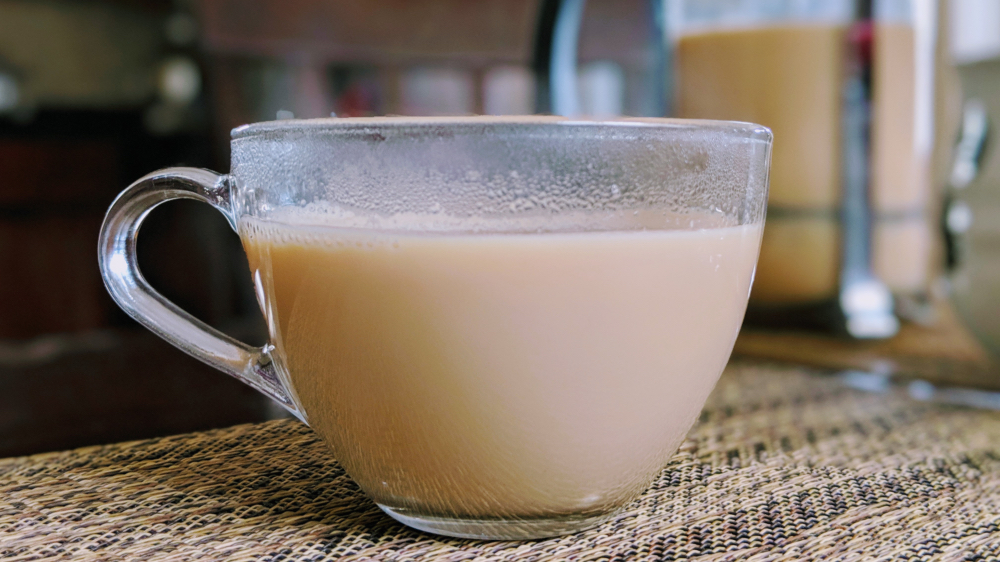

# Masala Chai

I had a bad habit of calling this chai tea (which would be the equivalent of me saying tea-tea). In any case, Masala tea is pretty stellar if you make it yourself because that Starbucks thing could use some help. Standard recipes call for the use of ginger, cardamom, cloves, and cinnamon, while other methods also use pepper, fennel, allspice, mint, etc. Consider Masala to be a house specialty. You will have versions that you like and others that don’t. The beauty here is that adding or removing ingredients, water, steeping in the tea for longer -literally, any change you make to the recipe will turn this into YOUR version of Masala tea. As such, don’t feel pressured to buy spices you would not usually own or follow my weirdly specific procedure. Know that I am only inviting you to my version below. So let's get to business.

## Info

* Makes 850ml-950ml or about 4 cups
* Prep Time: 4 minutes
* Cook Time: 15 minutes
* Total Time: 19 minutes

## Ingredients

### Items

* 1 pinch, fennel seeds
* 1 pinch, grated nutmeg
* 6g  (½-inch piece), ginger
* 1 (2-3 inch piece), cinnamon stick
* 6, allspice berries
* 6, cardamom pods
* 6, cloves
* 6, peppercorns
* 600ml (2½ cups), water
* 40g (3 tablespoons), sugar
* 8g (2 tablespoons), loose black tea
* 300ml (1¼ cup), milk or oat milk

### Tools

* scale (or measuring spoons as needed)
* pot (If I make 4-6 cups of Masala, I use a 2qt All-Clad pot)
* nutmeg or a Microplane grater.
* knife or mandoline slicer.
* cutting Board (only if using a knife).
* mortar and pestle (or some way to grind or press on spices)
* small dish
* wooden or silicon spoon for mixing
* French press (optional - this is my personal preference)
* strainer (especially if planning on preserving tea for the next day or so)
* stovetop

## Recipe

1. In a small pot, add **1 pinch**, fennel seeds, grate **1 pinch**, nutmeg Slice **6g**, ginger into chips using either a knife on a cutting board or a mandoline slicer (please be safe).  Split **1 (2-3 inch piece)**, cinnamon stick in half and transfer half of it the pot along with the sliced ginger. In a mortar and pestle add the remaining half of the cinnamon stick.

2. Gather **6** allspice berries, **6** cardamom pods, **6** cloves, **6** peppercorns and split half of all the items to the pot, and the other half to the mortar and pestle (3 in the pot whole, 3 in the mortar and pestle). Finely grind the ingredients and transfer them to the pot.

3. On a stove burner set to medium, toast the ingredients in the pot for a minute or so before adding **600ml**, water. Wait until the water begins to boil before adding **40g**, sugar, and **8g**, loose black tea.

4. Let the tea steep in water for 6 minutes before adding **300ml**, milk (or oat milk) which should slow down the boil. Allow the mixture to warm up after a few minutes and remove from the heat before it begins to boil again.

5. Transfer the mixture to a French press, or strain into a pitcher before serving.
