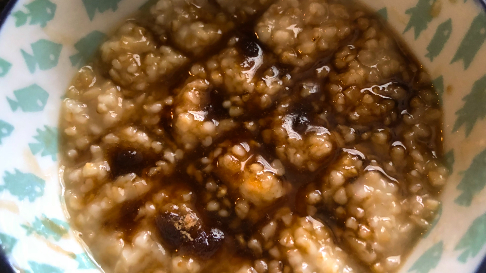
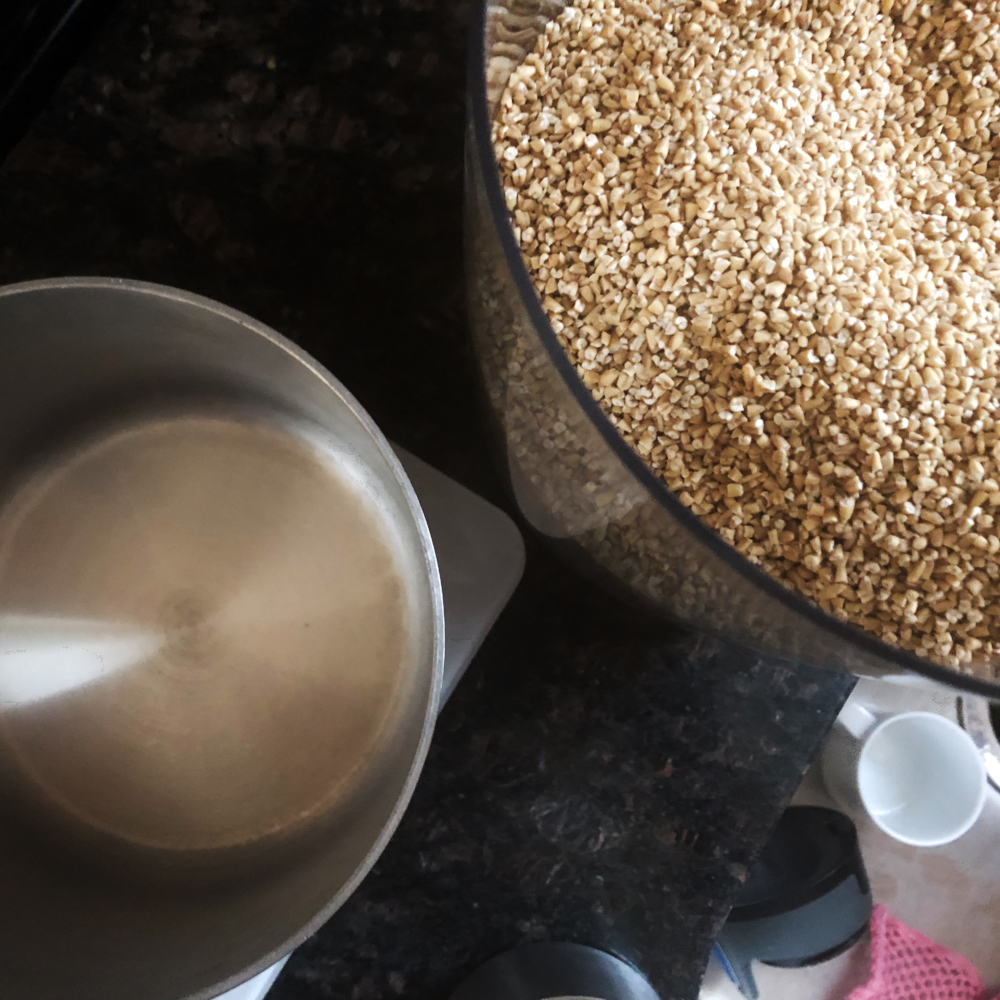
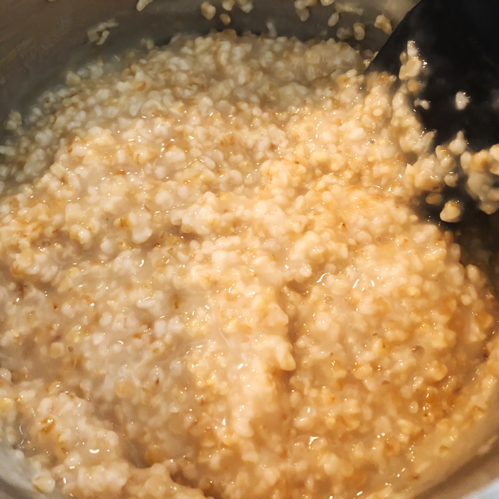

# Steel Cut Oats (Cut Groats)

Steel cut oats are the best. They are far more worth your time and effort than working with instant or rolled oats. The general way of looking at the differences in oats are as follows:

* Groats are the full oat seed untouched and un-tampered.
* Steel cut oats are groats cut in half (this helps speed up cooking time).
* Rolled oats are the whole groat steamed and flattened.
* Instant oats groats that are cooked, dried, rolled and pressed thinner than rolled oats.

If you wonder why you don’t like oatmeal, it's likely because you are eating instant oatmeal which will almost always produce a bit of a gloppy mess. My goal is to convince you to make oats that have not been processed in any way and just cook the seeds from scratch. Disclaimer: You should still buy rolled oats for shakes, pastries, muesli, etc - I'm just trying to convince you to not eat instant oatmeal anymore.

Now, the catch with cut oats however is timing. Rolled and instant oats cook in a matter of minutes but steel cuts is usually a 30 minute affair. That said, you can cheat a little by using an overnight method that will reduce the process in half. I'll cover both, but know that if you make a decent batch, you can preserve the rest of them in little containers and eat them throughout the week.

The goal is to have a creamy, somewhat chewy oatmeal with a subtle salty flavor. An oatmeal that is genuinely pleasant to eat entirely on its own, but gets punched up once you add a brown sugar, or milk, fruit, chocolate, etc. You get to decide. You're Mr Manager.

* Source: [Thomas Joseph - Kitchen Conundrums](https://www.youtube.com/watch?v=jN6HgpKxNQg)
* Ideas for toppings: [Jamie Oliver - Food Tube, Porridge Toppings](https://www.youtube.com/watch?v=ywkEGKXk2cQ)

## Ingredients

### Items

* **175g (1 cup)**, Steel cut oats.
* **948ml (4 cups)**, Water -for creamier oatmeal, otherwise **711ml (3 cups)** for denser.
* **5g (1/2 tsp)**, Kosher salt (Do not exceed this amount).

### Tools

* Scale for measuring, OR measuring cups.
* Pot (for 1 cup of oats, I use a 2qt All Clad pot).
* Wooden spoon OR something firm that can scrape the bottom of the pot without scratching.
* Colander or strainer if making overnight oats
* Stovetop.

## Recipe for same day oatmeal

1. In a small pot, add **175g (1 cup)**, of steel cut oats. Add **948ml (4 cups)** of water or less depending on preferred consistencies - you will know what you like the more you make it, and you may even end up watering it down even further for all I know.

2. On a low/med heat (maybe a 3 or 4 on your burner), every 3 or so minutes, stir the bottom of the pot to prevent the oats from sticking. This is one of those things you cant really leave unattended as it doesn’t take long for the bottom of the pot to completely create a layer of oats if unattended. This is why the type of spoon you use matters.

3. Around the 15 minute mark, you should start seeing a layer of foam at the top before the water begins to boil. if you can chew a little piece of the oat, you are at a decent enough stage to add add **SOME** of the **5g (1/2 tsp)**, kosher salt. I don’t know how much salt you like, but please don’t skip this step. Oatmeal should have a subtle salty taste.

4. Around the 18 minute mark, you should start to see a boil. Now is a good time to start stirring the pot with a little more frequency as you run the risk of burning the oats.

5. At the 30 minute mark, your oats should be creamy, and have a little chew with a subtle salty tinge. Now is where the fun begins! The oats are done and you can start transferring them to containers. I recommend this as you should treat this bare oatmeal mixture as your instant oatmeal base that you get to finish this to your liking. "Don't look at me Mr. Manager."

<!--  -->

## Recipe for overnight oatmeal

1. In a small pot, add **175g (1 cup)**, of steel cut oats. Add enough water to cover a little over 25mm or 1 inch of the oats. Cover the pot and wait until the next morning to begin.

2. using a colander or strainer, drain the water from the oats and transfer the oats back into the pot with fresh water. - because we soaked the oats overnight and they are hydrated, I'm going to recommend we use **711ml (3 cups)** of water but you can add or reduce as you see fit.

3. On a low/med heat (maybe a 3 or 4 on your burner), every 3 or so minutes, stir the bottom of the pot to prevent the oats from sticking. This is one of those things you cant really leave unattended as it doesn’t take long for the bottom of the pot to completely create a layer of oats if unattended. This is why the type of spoon you use matters.

4. After a few minutes, you should start seeing a layer of foam at the top before the water begins to boil. if you can chew a little piece of the oat, you are at a decent enough stage to add add **SOME** of the **5g (1/2 tsp)**, kosher salt. I don’t know how much salt you like, but please don’t skip this step. Oatmeal should have a subtle salty taste.

5. Once you start to see a boil, stirring the pot with a little more frequency as you run the risk of burning the oats.

6. At around 15 minute mark, your oats should be creamy, and have a little chew with a subtle salty tinge. Now is where the fun begins! The oats are done and you can start transferring them to containers. I recommend this as you should treat this bare oatmeal mixture as your instant oatmeal base that you get to finish this to your liking. "Don't look at me Mr. Manager."

